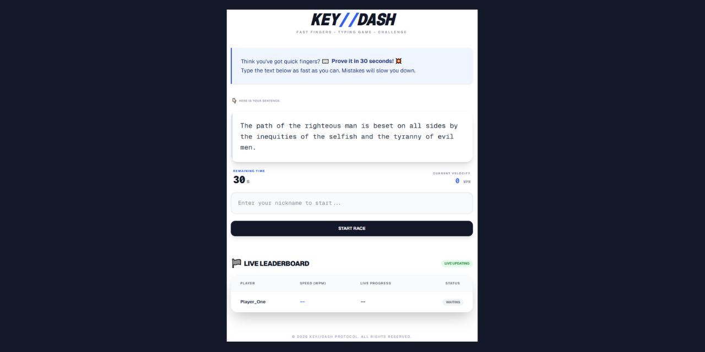

# 💻💥 KEY//DASH - Typeracer Game 💥💻

### Tonik - my project "KEY//DASH"

## Table of contents

- [Project Title](#-keydash---typeracer-game-)
- [Overview](#overview)
- [The Project](#the-project)
- [Technology stack](#technology-stack)
- [Links](#links)
- [Installation Instructions](#installation-instructions)
- [Visuals](#visuals)
- [Project Status](#project-status)
- [My Task approach](#my-task-approach)
- [Next Steps](#next-steps)
- [Author](#author)

## Overview

### The Project

A responsive, user friendly web app in Next.js, designed as a real-time writing competition for practicing typing skills. Each person who visits a page can join the game and spar with other contestants.

### Technology stack

- Framework: Next.js (TypeScript)
- Styling: Tailwind CSS
- Database & Real-time: Supabase

### Links

- Source code repository URL: [Github](https://github.com/basiacarvalho/tonic-my-project-typerracer)
- Live Site URL: [Live demo](https://tonic-my-project-typerracer.vercel.app/)

### Installation Instructions

To get this project running locally, follow these steps:

- Ensure you have Node.js and npm installed.
- Database Setup (Supabase).
- Local Environment:

1. Install dependencies: npm install
2. Create a .env.local file in the root directory and fill in your Supabase credentials:
   SUPABASE_URL=your_project_url
   SUPABASE_KEY=your_public_anon_key
3. Start the development server: npm run dev
4. Open http://localhost:3000 in your browser.

### Visuals

#### Desktop view :

### Project Status

Basic requirements completed within the 3 hours required time.
The basic concepts of the project have been met, however further ideas may be implemented and added in the future.

### My Task Approach

- In-depth review of the assignment.
- Analysis of individual requirements.
- Rapid research on developing "TypeRacer" style applications.
- Defining the Tech Stack.
- Creating a roadmap based on the provided timeframe.

Since many of the concepts and areas required for this task were new to me—and the deadline demanded strict prioritization and time management—I decided to build this application through close collaboration with Gemini, leveraging its full potential.

I independently planned the workflow and sequence of actions. I then used Gemini to generate the project's HTML and Tailwind CSS based on my specific guidelines. While I authored the README file myself, I primarily utilized Gemini to develop the core logic and implement Supabase.

### Next Steps

If given more time I would try to implement or consider using:

- Validation: Zod.
- Data Fetching: TanStack Query (React Query)
- UI Library like: shadcn/ui (based on Tailwind CSS).
- Extend metrics and stats calculations on accuracy together with handling edge cases.
- Dive into the topic of testing my app.
- Work on the user experience and gaming experience, for example: progress bar, some visuals, entertaining comments during the game.
- Spend more time on more modern, catchy, clean layout.
- I would re-think and extend the "game" logic: thinking about rounds, providing sentences for typing, etc.
- Think about screen readers, SEO, scalability.

### Author

- Barbara Carvalho 👩‍💻
